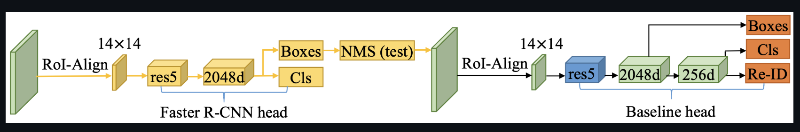
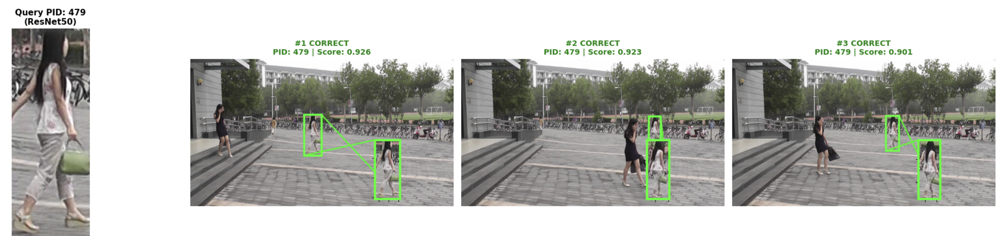
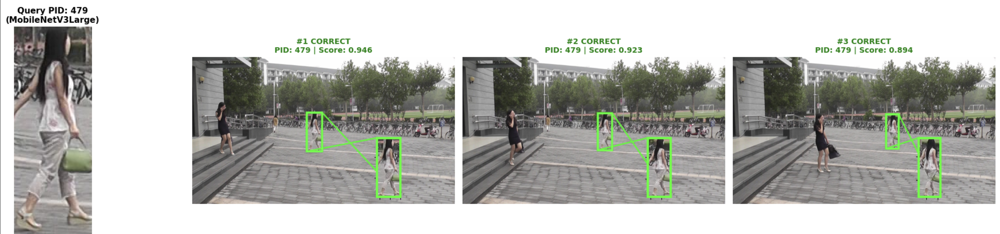
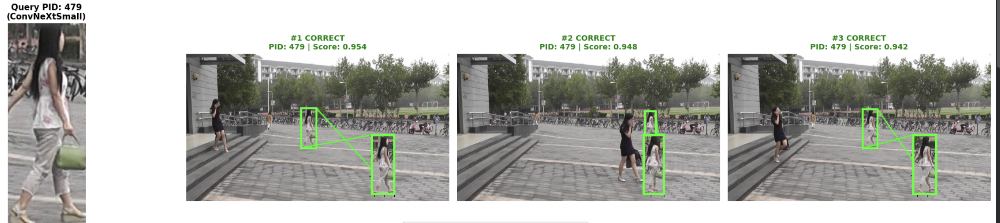
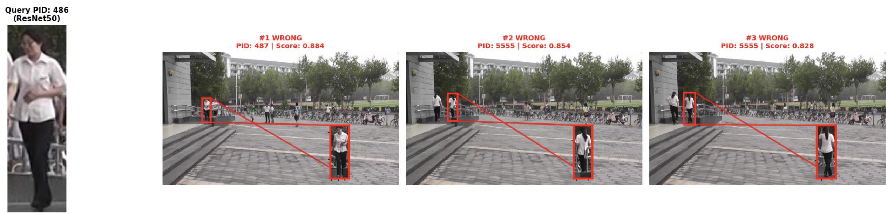
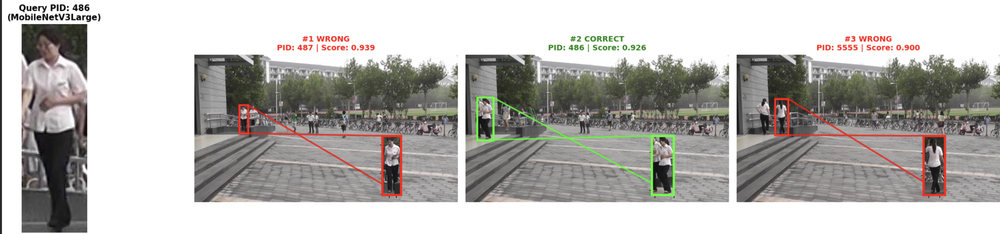
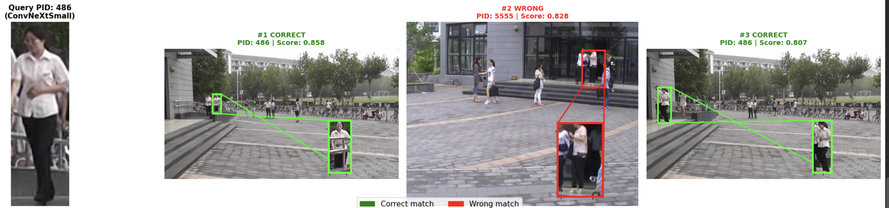

<!-- TOC start (generated with https://github.com/derlin/bitdowntoc) -->
# Table of Content
- [Person Search](#person-search)
   * [Architectural Choices](#architectural-choices)
      + [My Contributions](#my-contributions)
   * [Results](#results)
   * [MLCV Folder Structure](#mlcv-folder-structure)

<!-- TOC end -->

<!-- TOC --><a name="person-search"></a>
# Person Search


[](https://colab.research.google.com/github/SamueleCentanni/PersonSearch_PRW/blob/main/main.ipynb)

This is the final report for the exam *Machine Learning for Computer Vision*.

The exam focuses on addressing the **Person Search** task using the **PRW (Person Re-identification in the Wild)** dataset.

---

<!-- TOC --><a name="architectural-choices"></a>
## Architectural Choices

My solution implements the **SeqNet architecture**, the first end-to-end model designed for this task.  

SeqNet consists of two heads to solve **person detection** and **person re-ID**, respectively:  
1. A standard Faster R-CNN head to generate accurate bounding boxes (BBoxes).  
2. An unmodified baseline head to further fine-tune the BBoxes and extract discriminative features.  

The main idea is to leverage Faster R-CNN as a stronger RPN to provide fewer but higher-quality candidate BBoxes, leading to more discriminative embeddings.



<!-- TOC --><a name="my-contributions"></a>
### My Contributions

I conducted precise **ablation studies on the choice of backbone**. SeqNet relies heavily on Faster R-CNN for feature extraction. In particular, SeqNet implements a **ResNet-50 Faster R-CNN** backbone.

The backbone choice significantly affects detection quality and overall performance. I tested SeqNet with:

- **ResNet-50**  
- **MobileNet-V3-Large**  
- **ConvNeXt-Small**

These represent the historical evolution of CNN backbones.  
- ResNet introduced **Residual Connections**, achieving excellent ImageNet results.  
- MobileNet-V3-Large provides a **lightweight, fast architecture** with competitive performance.  
- ConvNeXt-Small is a **state-of-the-art CNN**, inspired by Visual Transformers.

---

<!-- TOC --><a name="results"></a>
## Results

SeqNet with **ConvNeXt-Small** achieves the highest performance but with a larger number of parameters and lower FPS.  

**MobileNet-V3-Large** is the best trade-off: >10× fewer parameters than ConvNeXt-Small and ResNet-50, similar accuracy, and much higher inference speed (2–3× FPS improvement).

**Results without Contextual Bipartite Graph Matching**

| Backbone | Total Params | Trainable Params | mAP (%) | Top-1 (%) | Inference (ms/img) |
| :--- | :---: | :---: | :---: | :---: | :---: |
| **ResNet50** | 48,418,735 | 48,409,199 | 47.06% | 83.71% | 22.3 |
| **MobileNetV3Large** | **5,428,199** | 5,427,735 | 47.95% | 83.62% | **10.6** |
| **ConvNeXtSmall** | 66,442,191 | 66,437,295 | **55.79%** | **87.12%** | 29.5 |

**Results with Contextual Bipartite Graph Matching**

| Backbone | Total Params | Trainable Params | mAP (%) | Top-1 (%) | Inference (ms/img) |
| :--- | :---: | :---: | :---: | :---: | :---: |
| **ResNet50** | 48,418,735 | 48,409,199 | 47.88% | 87.55% | 22.5 |
| **MobileNetV3Large** | **5,428,199** | 5,427,735 | 48.76% | 86.97% | **11.3** |
| **ConvNeXtSmall** | 66,442,191 | 66,437,295 | **56.48%** | **90.08%** | 30.8 |

For more details, check the [MLCV folder](MLCV), which contains the source code.  

To explore the code and see actual results, open the [notebook file](main.ipynb) on **Google Colab** for a seamless experience.  

> [!NOTE] 
> All results were obtained using an **H100 GPU** on Colab.

### Results Comparison

<div align="center">

**Agreement Results**

<table>
  <thead>
    <tr>
      <th>Backbone</th>
      <th>Results</th>
    </tr>
  </thead>
  <tbody>
    <tr>
      <td>ResNet-50</td>
      <td></td>
    </tr>
    <tr>
      <td>MobileNet-V3-Large</td>
      <td></td>
    </tr>
    <tr>
      <td>ConvNeXt-Small</td>
      <td></td>
    </tr>
  </tbody>
</table>

<br>

**Disagreement Results**

<table>
  <thead>
    <tr>
      <th>Backbone</th>
      <th>Results</th>
    </tr>
  </thead>
  <tbody>
    <tr>
      <td>ResNet-50</td>
      <td></td>
    </tr>
    <tr>
      <td>MobileNet-V3-Large</td>
      <td></td>
    </tr>
    <tr>
      <td>ConvNeXt-Small</td>
      <td></td>
    </tr>
  </tbody>
</table>

</div>

---

<!-- TOC --><a name="mlcv-folder-structure"></a>
## MLCV Folder Structure
```
MLCV/                         # Python package
├── config.py                 # Hyperparameters and global config
├── dataset/
│   ├── base.py               # BaseDataset class
│   ├── build.py              # DataLoader builders, collate_fn, statistics
│   ├── prw.py                # PRW dataset class
│   ├── splits.py             # Train/val split construction
│   └── transforms.py         # Image transforms
├── model/
│   ├── convnext.py           # ConvNeXt-Small backbone implementation
│   ├── mobilnet.py           # MobileNet-V3-Large backbone implementation
│   ├── oim.py                # OIM loss (Online Instance Matching)
│   ├── resnet.py             # ResNet backbone + Res5Head
│   └── seqnet.py             # SeqNet model, SeqRoIHeads, NormAwareEmbedding, BBoxRegressor
├── testing/
│   ├── eval_search_prw.py    # PRW search evaluation (mAP, top-1)
│   ├── evaluation.py         # evaluate_performance() — full eval pipeline
│   └── km.py                 # Kuhn-Munkres algorithm for CBGM
├── training/
│   ├── setup.py              # build_prw_loaders() — constructs all DataLoaders
│   ├── train.py              # run_experiment() — full training loop
│   └── train_utils.py        # train_one_epoch(), validate_one_epoch(), helpers
├── utils/
│   ├── inspection.py         # .mat file inspection helpers
│   ├── runtime.py            # get_device()
│   └── seed.py               # fix_random()
└── visualization/
  ├── comparison.py         # comparison plots and summary visuals
  ├── knn_viz.py            # KNN visualization utilities
  └── prw_viz.py            # PRW-specific visualization (draw_boxes, render frames)
```
